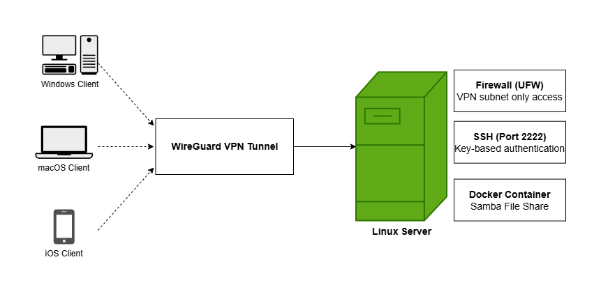
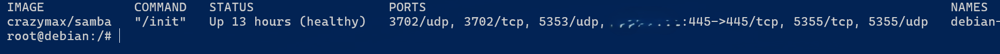
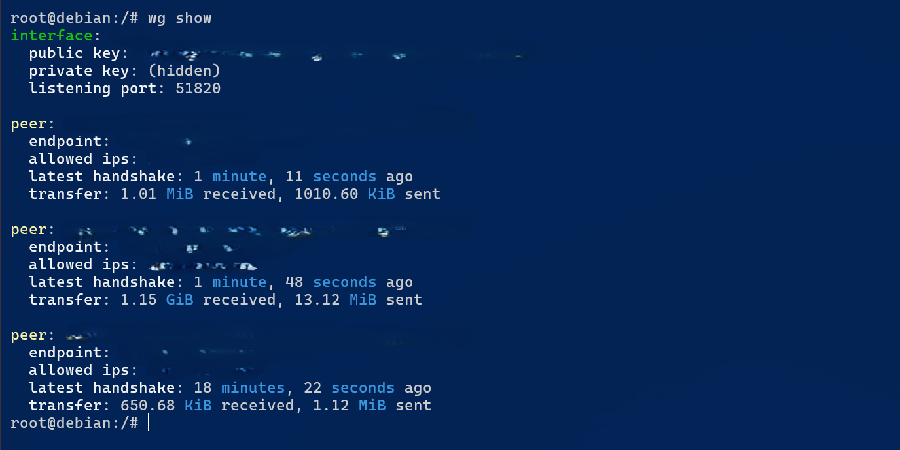
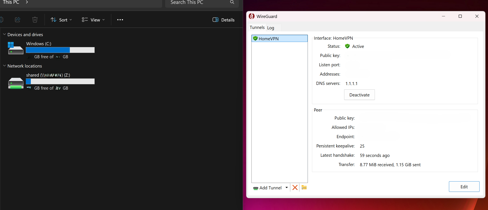
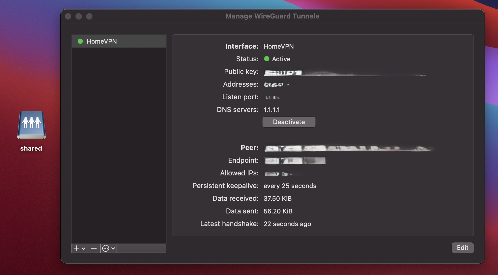
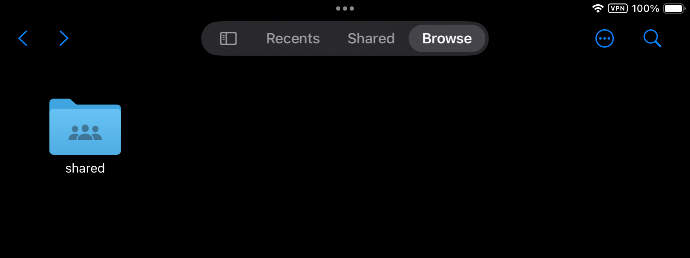
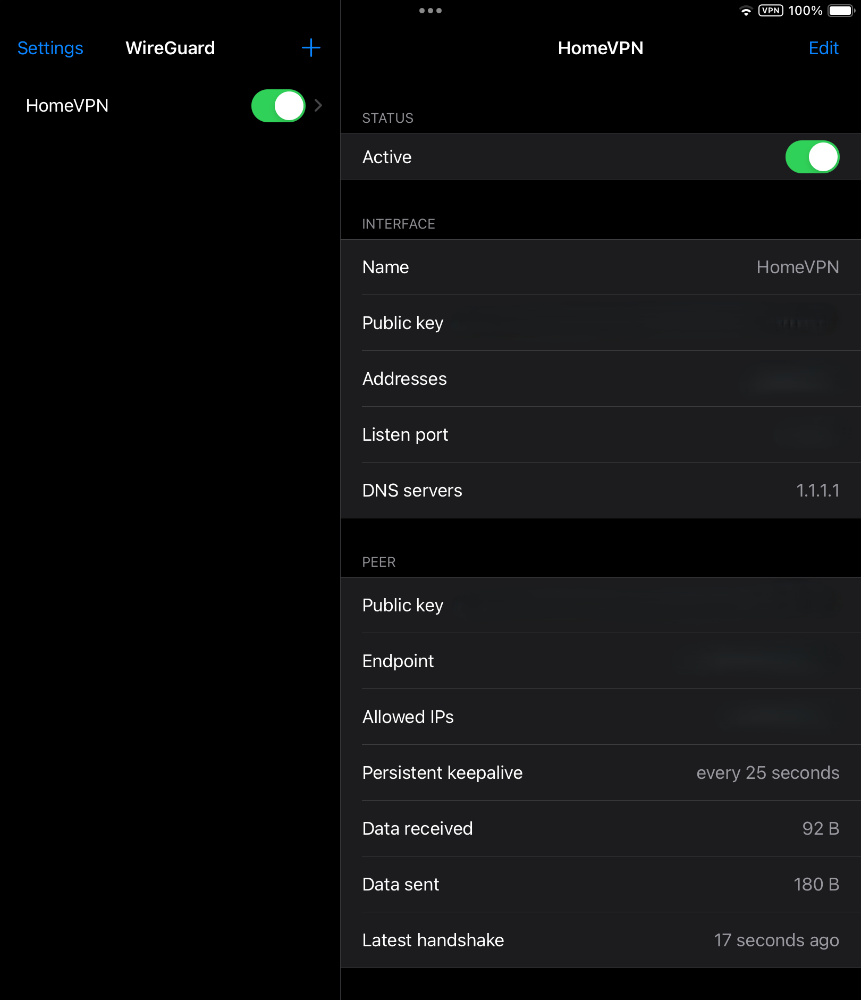

# Secure Cross-Platform File Sharing Server

## Overview
A self-hosted secure file-sharing system for Windows, macOS, and iOS devices. The project combines WireGuard VPN tunneling, Dockerized Samba services, SSH hardening, and firewall segmentation to provide secure remote access to sensitive documents while minimizing exposed attack surface.

## Architecture

## Features
- Secure SSH administration using key-based authentication
- WireGuard VPN-based private network access layer
- Dockerized Samba file-sharing service for isolated deployment
- Firewall rules restricting all services to VPN-only traffic
- DHCP reservations for consistent host identification
- Cross-platform file access (Windows, macOS, iOS)

## Security Measures
- Disabled SSH password authentication and enforced key-based authentication
- Disabled root SSH login to enforce least-privilege access principles
- Moved SSH service to a non-standard port to reduce automated scanning noise
- Restricted SMB access to VPN subnet via host-based firewall rules
- Configured host-based firewall rules (UFW) to restrict management traffic to the VPN interface
- Implemented WireGuard for encrypted remote network access

## Configuration Files
All configuration files used in this project are available in the `/configs` directory.

## Screenshots

### Windows Client

### macOS Client

### iOS Client

## Lessons Learned
- Designing network segmentation using VPN-based access control
- Troubleshooting Docker networking and Samba permission issues
- Implementing secure SSH authentication using key-based workflows
- Understanding firewall rule ordering and service exposure risks in Linux systems
